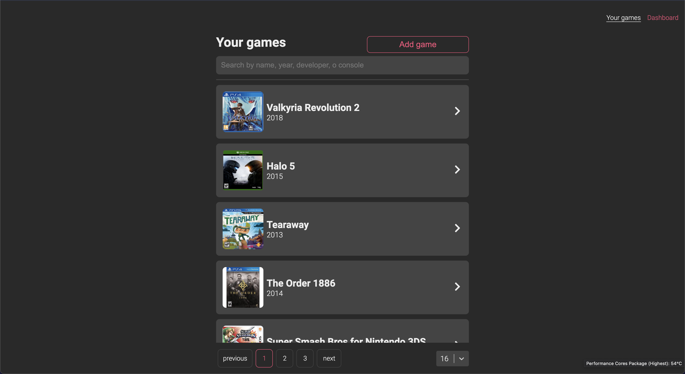

<h1 align="center">
  Games Tracker
</h1>

<p align="center">
  <a href="#key-features">Key Features</a> •
  <a href="#specifications">Specifications</a> •
  <a href="https://games-tracker-grumafe.vercel.app/" target="_blank">Demo</a> •
  <a href="#collaborators">Collaborators</a>
</p>

<div align="">
   <p>
      <b>Game tracker</b> is the simple application where you can add your favorites videogames, <i>Created for Gremafu.</i>
   </p>
</div>

<div align="center">
  
</div>

<div align="center">
  <i>Take a look of the demo <a href="https://games-tracker-grumafe.vercel.app/">here.</a> 🤖
  </i>
</div>

<br/>

## Key Features

- Add videogames.
- Edit existins videogames.
- search by name, release year, platform or company.
- Pagination and contro resuls by page.
- Take a look on dasboard and check out videogames by consoles.

<br>
<hr>

## Try it out

First, clone the repo, make `npm install `, then run the development server with:

```bash
npm run dev
# or
yarn dev
```

## Specifications

<p>The application was made with <b>React and NextJs as core</b>, Sass as preprocessor, Axios for https request, React Hook Form for inputs validation.</p>

- [React](https://reactjs.org/)
- [NextJs](https://nextjs.org/)
- [axios](https://github.com/axios/axios)
- [SASS](https://sass-lang.com/)
- [React-select](https://react-select.com/)
  - [react-form-hook](https://react-hook-form.com/)
- [react-paginate](https://www.npmjs.com/package/react-paginate)
- [react-vis](https://uber.github.io/react-vis/)
